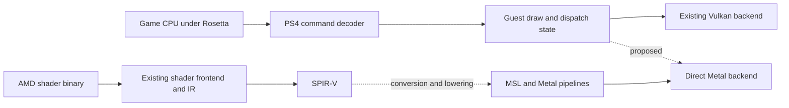

# Apple GPU handling and direct Metal research

Date: 2026-10-05. Target: **original 30 FPS game timing with consistent 33.333 ms
presentation**, as requested by the user. Higher FPS patches and frame generation
are outside this target.

## Decision

Keep the game under Rosetta. Investigate presentation, upload/fence ordering and
render-pass costs in the existing Vulkan backend first. Develop a direct Metal
backend as a measured experiment alongside it, starting with the shader and
resource contracts rather than a wholesale rewrite.

This investigation traced local source and processed the existing shader cache.
It did not launch another game run, measure a new FPS improvement, or execute
shaders through a Metal device. Runtime renderer defaults were not changed.

## 1. New findings in the current renderer

| Finding | Local evidence | Consequence |
| --- | --- | --- |
| Frame statistics measure guest flip processing, not actual screen presentation | `gpu/shadps4/core/libraries/videoout/driver.cpp:71`, `:290`: `RunPresenter` normally queues work to `bb:Present`; the statistics run after enqueueing | The previous 19 FPS result is guest flip throughput. Screen cadence and present-queue delay require their own measurements. |
| One frame ahead is deliberately enforced | `gpu/shadps4/video_core/renderer_vulkan/vk_presenter.cpp:414` | The old 63–64% GPU-tick wait includes a pacing/backpressure mechanism. It is not all avoidable overhead. |
| Small guest copies run on the Vulkan recording thread | `gpu/shadps4/video_core/buffer_cache/buffer_cache.cpp:119`, `:287`; `vk_scheduler.h:801` | Host-copy waits can mean waiting behind driver command encoding, not simply slow memcpy or an undersized copy pool. |
| All render attachments currently use Store | `gpu/shadps4/video_core/renderer_vulkan/vk_scheduler.cpp:55` | Extra pass endings can cause extra attachment traffic on an Apple GPU. Attachment lifetime must be established before selecting DontCare. |
| The built-in profiler ends render passes to insert timestamps | `gpu/shadps4/video_core/renderer_vulkan/vk_gpu_profiler.cpp:35` | Fine-grained profiling can change the workload. First use CPU counters, coarse submission measurements or a separate Metal capture. |
| GC refuses downloads of GPU-written tiled images | `gpu/shadps4/video_core/texture_cache/texture_cache.cpp:1061` | No evictions under pressure can have a correctness reason. Raising the budget or discarding such images is not a repair. |
| Shader profile contains explicit KosmicKrisp workarounds | `gpu/shadps4/video_core/renderer_vulkan/vk_pipeline_cache.cpp:337` | A Metal profile must reconsider LDS barriers, UNORM fixes and buffer alignment without losing required shader behavior. |

The driver translates Vulkan to Metal 4 already. A direct backend needs to improve
the work submitted, not merely adopt Metal 4 objects that the driver may already
use. [Mesa KosmicKrisp documentation](https://docs.mesa3d.org/drivers/kosmickrisp.html)

### Frame pacing and instrumentation

The launcher already requests `BB_FPS=30`; the unpatched game's timing is retained.
With `BB_VBLANK_HZ=60`, the video-output emulation runs at 60 Hz. The host swapchain
requests Mailbox by default (`gpu/shim/core/emulator_settings.h:27`). The guest
vblank timer is not proof that the host display presents at the same deadlines.

Measure distinct points using monotonic timestamps and frame IDs:

1. Guest flip arrives and its GPU work is submitted.
2. Work becomes ready for presentation.
3. Work enters/leaves the swap-thread queue.
4. Drawable/swapchain acquire and present calls begin/end.
5. Actual presentation time, through a supported timing extension or Metal
   drawable presentation feedback. Completion of a present API call is not
   equivalent to scanout.

Keep guest-visible flip/vblank events and display pacing conceptually separate.
Preserve the guest buffer-release rules. Avoid adding independent sleep-based
limiters at multiple stages. Late frames should not trigger a burst of catch-up
presents; a host-side policy must not silently discard the guest's required
completion events.

For direct Metal, evaluate `CAMetalDisplayLink` with a preferred 30 FPS range and
bounded frame latency. It schedules updates for a target `CAMetalLayer`; preferred
rates remain requests to the system, so verify actual presentation times.
[Apple CAMetalDisplayLink](https://developer.apple.com/documentation/quartzcore/cametaldisplaylink),
[preferred frame-rate range](https://developer.apple.com/documentation/quartzcore/cametaldisplaylink/preferredframeraterange)

At fixed 60 Hz, 30 FPS means one new frame every two refreshes; at 120 Hz, every
four. Other display rates and variable refresh need separate handling. Prioritize
median/p95/p99 presentation intervals, missed 33.333 ms deadlines and input-to-
presentation delay over average FPS. A 30 FPS mean with alternating short/long
intervals does not meet the goal. Aim for useful GPU/encoding headroom below the
33.333 ms deadline; around 25–28 ms is a planning budget, not a measured result.

### Existing renderer experiments, in order

| Priority | Experiment | Measure | Constraint |
| --- | --- | --- | --- |
| 1 | Independent prep-worker / DrawPipeline boot isolation | Assertions, corrupt packet reports, repeated map loading | Retain the conservative configuration until the unsafe path is identified. |
| 2 | Identical warmed scene, 1080p versus 720p | Guest flips, GPU completion and actual presents | Distinguish pixel/pass cost from CPU/submission cost; keep 30 FPS game timing. |
| 3 | `BB_FRAMES_AHEAD=1` versus `2` | Deadline misses, latency and memory footprint | Two may hide short stalls; it cannot fix sustained GPU work over budget. Do not make unlimited queuing the default. |
| 4 | Mailbox versus FIFO if supported, separately from queue-depth changes | Actual cadence, acquire wait and queue delay | Use a matched display mode; requested mode is not necessarily available. |
| 5 | Recorder on/off (`BB_VK_RECORD_THREAD`) and existing buffer statistics | CPU encode time, small-copy wait and upload bytes | One changed variable at a time; same scene, no pipeline compilation window. |
| 6 | Identify pass-ending reasons and attachment lifetime | Encoders/passes, bandwidth and GPU duration | Merge only compatible passes without crossing a real resource dependency. |

The existing `BB_BUFFER_STATS=1` reports stream-copy and arena-upload use.
`BB_RECORDER_TRACE=1` identifies direct command-buffer callers, but is intrusive
and should be enabled only in a separate diagnostic run. Existing toggle bit
524288 selects a different small-copy path; its effects also need isolation.

`WaitHostCopies` protects guest memory reuse and submission input readiness.
`WaitDeferredSignals` preserves guest-visible write/fence order. Removing either
wait based on its percentage risks corruption. First attribute each wait to its
reason, outstanding byte count and recorder progress. Reduce avoidable waits
through safe batching and ordered completion, rather than weakening the contract.

## 2. Render passes, copies and residency

Apple documents that merging compatible passes and choosing load/store actions
based on lifetime can reduce system-memory traffic on its tile-based GPUs.
[Apple: Optimize Metal Performance for Apple silicon Macs](https://developer.apple.com/videos/play/wwdc2020/10632/)

For this renderer, start by counting state changes, barriers, uploads and dispatches
that end a pass. The existing scheduler already reuses an open pass when the
render state is identical, so "merge passes" is not an entirely missing feature.
Keep stores whenever later shaders, guest readbacks, aliases or display buffers
need the contents. Transient host-only intermediates are the safest candidates
for discard or memoryless storage when supported by their full lifetime.

Apple unified memory does not make PS4 tiled textures directly usable as Metal
textures. Separate three kinds of work: linear buffer snapshots, tiled image
conversion, and GPU-written guest-memory readback. Investigate stable shared
linear buffers first; retain conversion for layout differences. CPU/GPU access
must still be ordered, even for shared storage.
[Apple: Synchronizing CPU and GPU work](https://developer.apple.com/documentation/metal/synchronizing-cpu-and-gpu-work)

Record memory separately for guest backing, host upload rings, buffers, image
allocations and temporary presentation targets. Do not report the entire driver
budget as texture memory. Audit stale images and alias generations before changing
GC policy; lifetime errors can destroy guest data.

## 3. Actual cached-shader feasibility investigation

Input: local `out/macos-run/user/cache/CUSA03173/*.spv`. This is an accumulated
cache of visited content and variants, not a complete inventory of the game.
SPIR-V declarations can overstate features actually used by instructions.

493 modules were inspected and passed through the already installed
`/usr/local/bin/spirv-cross`, revision `vulkan-sdk-1.4.357.0`, timestamp
2026-08-17. Options: `--msl --msl-version 30100 --msl-argument-buffers
--msl-argument-buffer-tier 2` (MSL 3.1, Tier 2 argument buffers).

| SPIR-V stage | Modules | CLI emitted source | Qualification |
| --- | ---: | ---: | --- |
| Vertex | 200 | 200 | Metal compiler, binding and pipeline validation still required. |
| Fragment | 236 | 236 | Same; match interpolation, depth/stencil, formats and numerical behavior. |
| Compute | 38 | 38 | Same; validate dispatch sizes, image operations and synchronization. |
| Tessellation control | 7 | 7 | Generated kernels need control-point/patch buffers and host orchestration. |
| Tessellation evaluation | 9 | 9 | Generated patch entry points need matching tessellation configuration. |
| Geometry | 3 | 3 | **Invalid output**: `unknown` entry-point qualifier plus `EmitVertex` / `EndPrimitive`. |

All CLI invocations returned zero, but that is not compiler success. All three
geometry variants are suspect; they correspond to two filename hash prefixes.
We cannot call the other 490 modules Metal-compatible until the Metal compiler
and correctly configured pipelines accept them and their behavior is compared.

All observed modules use logical addressing. No physical-storage-buffer addressing
was present in this sample. The emitter can use physical addressing for DMA/motion
paths, so this observation does not eliminate that issue in other configurations.
The inventory includes subgroup operations, tessellation and AMD image-load/store
LOD declarations that need a Metal-specific capability/lowering review.

`xcrun --find metal` failed; the selected developer directory is CommandLineTools.
No tools were installed. Runtime Metal source compilation through
`MTLDevice::newLibraryWithSource:options:error:` is another available development
route to investigate; it was not invoked here.
[Apple runtime library compilation API](https://developer.apple.com/documentation/metal/mtldevice/makelibrary(source:options:)?language=objc)

Local artifacts (ignored, game-derived, retained locally):

- `out/macos-metal-shader-inventory.json`: stage, capability, extension and addressing inventory.
- `out/macos-metal-research/conversion-results.json`: exact options, per-module status and suspicious source markers.
- `out/macos-metal-research/*.metal`: generated source, approximately 8.6 MiB in total with the report.

## 4. Direct Metal backend design

Reuse the AMD instruction frontend, shader IR/optimizations, guest register
decoding, format/tiling knowledge, shader hashes and relevant game-specific HLE.
Create a Metal resource/binding contract. Replace Vulkan pipeline/descriptor
management, scheduler, presentation and device resource objects. Buffer and
texture caches contain Vulkan types, and Liverpool explicitly binds a
`Vulkan::Rasterizer`; this is not a drop-in backend switch.

Keep the first Metal backend in the x86-64 game process, with host encoding under
Rosetta. "Direct Metal" then means no Vulkan API layer; it does not mean native
ARM64 CPU encoding. A separate ARM64 renderer would require a shared-memory and
completion protocol and is a later independent project.

Metal 4 offers explicit command allocation, argument tables, residency sets and
stage barriers. Evaluate those for the backend's data contract, with correct
resource residency and allocator retirement. They do not automatically remove
guest fences or guarantee a speedup over KosmicKrisp.
[Apple: Discover Metal 4](https://developer.apple.com/videos/play/wwdc2025/205/)

### Small stages with explicit decision gates

1. **Shader compilation:** compile representative vertex, fragment and compute
   source through Metal; collect warnings and actual resource reflection. Then
   cover the rest of the cache. Gate: valid compiled entry points, not CLI exit codes.
2. **Resource and compute proof:** execute one captured game compute workload with
   its real buffer/texture layout and compare output. Gate: correct data, measured
   encode/GPU/copy costs, no guest code or whole-backend refactor required yet.
3. **Draw proof:** a real vertex/fragment pair with matching attachments, bindings,
   constants and depth state. Gate: correct output and timings at both resolutions.
4. **Stage coverage:** implement geometry lowering and tessellation orchestration;
   verify guest semantics, subgroup behavior and indirect work. Geometry can be
   lowered through compute plus an indirect draw or an appropriate mesh path;
   neither approach is implemented or measured here.
5. **Presentation and integration:** paced 30 FPS Metal drawable output, guest
   completion events and resource retirement. Keep backend selection explicit.
6. **Representative scene decision:** expand only after correct gameplay shows
   better frame-time consistency, memory use or encoding cost. A triangle or an
   isolated shader alone cannot establish an advantage for the full game.

Do not refactor every graphics call into a broad abstraction before these gates.
Start with the concrete resource/draw records that the proofs require.

## 5. Profiling route and limits

The installed KosmicKrisp binary contains `MESA_KK_GPU_CAPTURE` and
`MESA_KK_GPU_CAPTURE_DIRECTORY`. Mesa documents capture from device creation to
destruction, so use a short, separate session with an explicit output directory;
whole-session captures can be large and intrusive. `MESA_KK_DEBUG=msl` logs generated
MSL for inspection, not for performance measurement.
[Mesa capture/debug settings](https://docs.mesa3d.org/drivers/kosmickrisp.html#environment-variables)

For the next measurement batch, use a fixed camera/save, identical resolution and
display mode, warm caches, and the conservative GPU path. Separate shader-load
stalls from steady intervals. Count guest flips and actual presents independently.
Observe CPU scheduling and compressed-memory activity without treating system-wide
counters as this process's work. Compare configurations over repeated windows.

Research result: a direct Metal path has a concrete shader starting point and
identified integration work. The shortest route to the user's 30 FPS pacing goal
still begins with reliable timing attribution and reducing proven critical-path
work in the existing renderer. No FPS gain or direct Metal gameplay is established.

## Implementation follow-up: 2026-10-05

Opt-in host presentation diagnostics and an experimental MetalFX spatial pass
have now been implemented. The macOS launcher requests FIFO with the unpatched
30 FPS preset. [MetalFX implementation details](MACOS_METALFX.md) explain the
shared Metal heap path, capability-query results and the initial CPU completion
bridge. [Performance diagnostics](MACOS_PERFORMANCE.md#presentation-diagnostics-and-30-fps-defaults-2026-10-05)
separate guest flip timing, swap-thread delay, presentation API stages and the
frames-ahead wait. The changes do not establish a new gameplay FPS result.

## Native presentation follow-up: 2026-10-06

[Native Metal presentation](MACOS_NATIVE_METAL.md) now displays Vulkan-rendered
gameplay through a Metal render pass and drawable, including the settings
overlay and optional MetalFX spatial scaling. It removes the hybrid path's
shared-output copy and final Vulkan swapchain blit. The game shader/compute
backend and host post-processing still use Vulkan; a full native graphics
backend and a measured performance advantage remain unproven. The next focused
step is to render the host frame directly into exportable storage, then execute
a representative captured game workload through native Metal.
